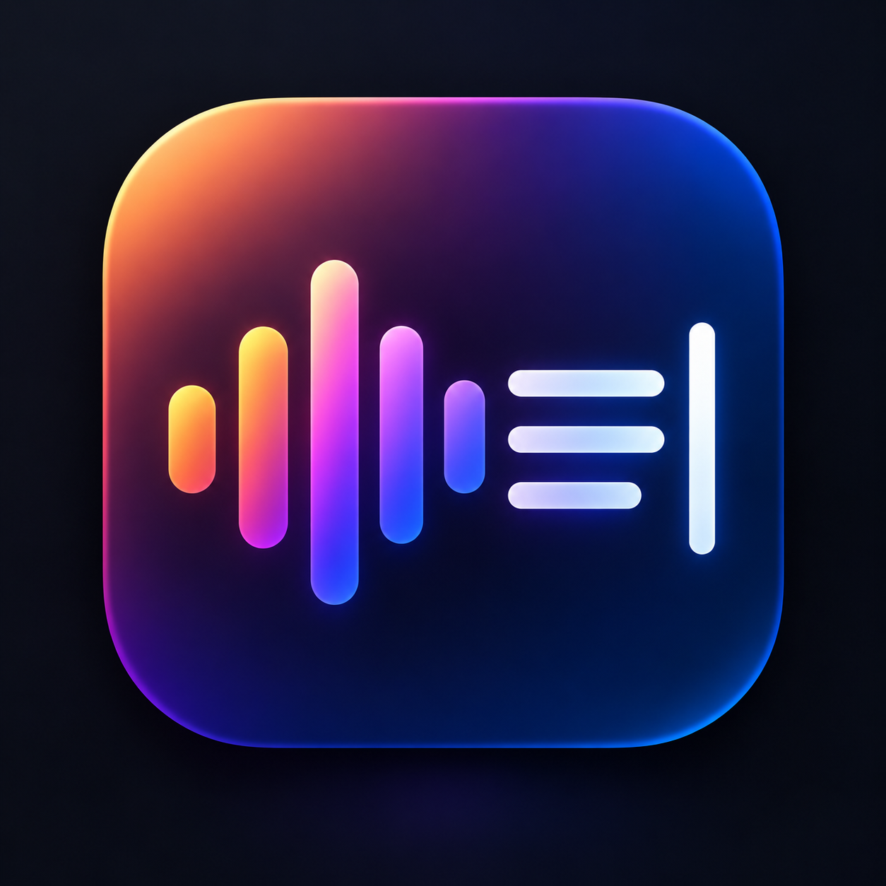
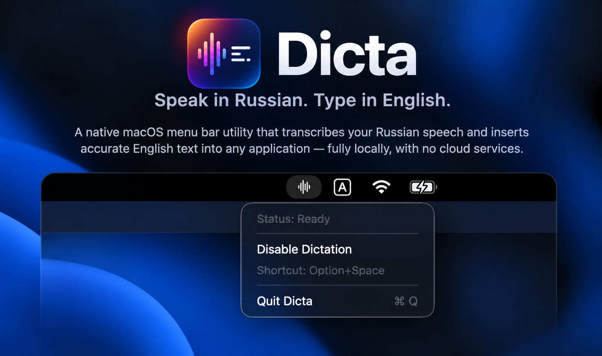
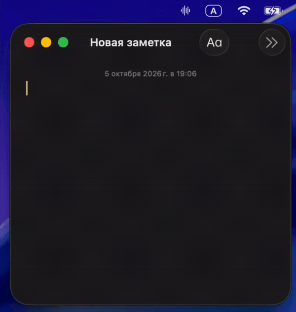

<p align="center">
  
</p>

<h1 align="center">Dicta</h1>

<p align="center"><strong>Speak in Russian. Type in English.</strong></p>

Dicta is a focused macOS menu bar utility that turns spoken Russian into
English text. Hold **Option+Space**, speak, and release — Dicta
translates your speech locally and inserts the result at the current cursor
position. Remain in the same application/window until insertion is complete.

## Screenshot



## Demo

Hold **Option+Space**, speak in Russian, then release. Dicta translates your speech locally and inserts the English text at the current cursor position.



## What is Dicta?

Dicta is designed for people who prefer speaking Russian but need to write in
English. It is especially useful for dictating prompts, messages, notes, and
other text without switching away from the application currently in use.
It is written primarily in Python and uses PyObjC for its native-feeling macOS
menu bar and system integration.

When dictation begins, Dicta remembers which application it started in. After
recording stops, it translates the speech with a local Whisper model and
verifies that you are still in the expected application/window before
inserting the English text at the current cursor position. Dicta does not
automatically switch applications or restore an earlier text field. It does
not press Enter or Return.

Dicta runs in the macOS menu bar without a normal Dock window. It is intended
to work with many standard editable areas in browsers, ChatGPT, editors,
terminals, Notes, messengers, email clients, and other macOS applications,
subject to each application's Accessibility behavior.

## Features

- Local Russian speech recognition and Russian-to-English translation.
- Global **Option+Space** push-to-talk shortcut.
- Inserts translated text at the current cursor position.
- Verifies the expected application/window before insertion and may safely
  refuse insertion if the user has switched to another application or window.
- Preserves the existing clipboard when Dicta still owns the temporary
  clipboard contents; it also avoids overwriting a newer clipboard change.
- Menu bar statuses: **Ready**, **Recording**, **Translating**, and
  **Disabled**.
- Menu controls to enable or disable dictation, display the shortcut, and quit.
- No cloud speech or translation API, API key, account, or subscription.
- Standalone Apple Silicon application with whisper.cpp and the model bundled.

## Requirements

- macOS 26 or later.
- Apple Silicon Mac (`arm64`). Intel Macs are not supported.
- Microphone, Accessibility, and Input Monitoring permissions.
- Approximately 1.5 GB or more of free disk space, primarily for the bundled
  Whisper medium model. Additional temporary space is needed while extracting
  the download.

## Installation

Regular users do not need Python, Homebrew, CMake, Git, whisper.cpp, or any
developer tools. The downloadable application contains its model and native
runtime dependencies.

1. Open the **Releases** section of this repository.
2. Download **Dicta.zip**.
3. Extract the zip file.
4. Move **Dicta.app** to the **Applications** folder.
5. Open Dicta from Applications.

Dicta appears in the menu bar. It does not open a normal application window or
add a regular Dock window.

## First Launch and Gatekeeper

Dicta is currently ad-hoc signed and is not notarized by Apple. Because macOS
cannot verify an identified developer for this build, Gatekeeper may block the
first launch.

Use macOS's per-app approval workflow:

1. Try to open Dicta once from the Applications folder.
2. Open **System Settings → Privacy & Security**.
3. Scroll to the security message about Dicta and click **Open Anyway**.
4. Confirm by clicking **Open**.

Only approve a copy obtained from this repository's official Releases section.
There is no need to disable Gatekeeper or change macOS security globally.

## Permissions

Dicta needs three macOS permissions:

- **Microphone** — records your voice from the Mac's selected input device.
- **Accessibility** — helps Dicta verify the target window when available and
  send the paste command.
- **Input Monitoring** — detects the global **Option+Space** shortcut while
  another application is active.

You can review these permissions under **System Settings → Privacy &
Security**, in the **Microphone**, **Accessibility**, and **Input Monitoring**
sections. Enable Dicta in each required section, then quit and reopen it.

If a rebuilt or replaced copy of Dicta is no longer recognized, remove the old
Dicta entry from the affected permission section, add or enable the exact
current `/Applications/Dicta.app`, and restart Dicta.

When running from source, macOS permissions apply to the terminal application
that launches Dicta rather than to a packaged `Dicta.app`.

## How to Use

1. Launch Dicta and confirm that its waveform icon appears in the menu bar.
2. Place the cursor where you want the English text to be inserted.
3. Hold **Option+Space**.
4. Speak in Russian.
5. Release **Option+Space** to stop recording.
6. Wait while the menu status shows **Translating**.
7. Dicta translates your speech locally, and the English translation appears
   at the current cursor position.

Remain in the same application/window during the operation. If you switch to
another application or window, Dicta may safely refuse insertion rather than
switching back.

Dicta never sends Enter or Return automatically. Review or edit the inserted
text, then submit it yourself when ready.

The menu bar menu shows the current status and shortcut. Use **Disable
Dictation** to temporarily ignore the shortcut, **Enable Dictation** to resume,
or **Quit Dicta** to close the application.

## Privacy

Speech processing happens locally on your Mac. Dicta records audio into a
temporary WAV file and processes it locally with whisper.cpp and the bundled
Whisper model.

Dicta does not require a cloud transcription or translation service, an OpenAI
API key, a user account, or a subscription. The application does not
intentionally upload dictated audio or translated text to a remote service.
Temporary recording data is cleaned up after the dictation session during
normal operation.

## How It Works

The runtime pipeline is deliberately small:

```text
Microphone
    → temporary 16 kHz mono WAV
    → local whisper.cpp Russian-to-English translation
    → verify the expected application and optional reliable window context
    → temporary clipboard text + physical Command+V at the current cursor
    → restore the previous clipboard contents if Dicta still owns them
```

Dicta captures the frontmost application and, when reliable information is
available, its window context before recording. Before insertion, it verifies
that the expected application and optional window are still active. It does
not reactivate applications or restore an earlier text field. Dicta temporarily
places the translation on the clipboard, sends physical Command+V at the
current cursor position, and restores the previous clipboard contents only if
no newer clipboard change has occurred.

## For Developers

The following instructions are only for building or running Dicta from source.
They are not part of normal user installation.

### Prerequisites

- Apple Silicon Mac running macOS 26 or later
- Python 3.14
- Git
- CMake
- Xcode Command Line Tools

The current packaged build uses Homebrew's Python 3.14 distribution. Clone this
repository using the URL provided by GitHub's **Code** button, enter the cloned
repository directory, and run the remaining commands from its root.

### Python environment

```bash
python3.14 -m venv .venv
.venv/bin/python -m pip install --upgrade pip
.venv/bin/python -m pip install -r requirements.txt -r requirements-build.txt
```

The runtime requirements include sounddevice, pynput, CFFI, six, and the
required PyObjC frameworks. PyInstaller is a pinned build-time dependency.

### Prepare whisper.cpp and the model

```bash
.venv/bin/python packaging/setup_whisper.py
```

The setup script:

- clones whisper.cpp `v1.9.4` into the ignored `vendor/whisper.cpp/` directory;
- verifies immutable commit
  `927cfce34f31707e17f2bff35c349632fb9e2c3a`;
- builds the Release `whisper-cli` target for Apple Silicon; and
- downloads `ggml-medium.bin` and verifies SHA-256
  `6c14d5adee5f86394037b4e4e8b59f1673b6cee10e3cf0b11bbdbee79c156208`.

The checkout, model, and compiled whisper.cpp output are intentionally excluded
from Git. Validate an existing setup without downloading or rebuilding it:

```bash
.venv/bin/python packaging/setup_whisper.py --check
```

### Run from source

Run the menu bar application:

```bash
.venv/bin/python -m voice_translator
```

Run one terminal-controlled recording and print its translation:

```bash
.venv/bin/python -m voice_translator --terminal
```

The terminal mode waits for Enter to start, records until Enter is pressed
again, translates locally, and prints the English text. It does not provide the
global menu bar workflow.

### Run the tests

```bash
.venv/bin/python -m unittest discover -s tests -v
```

For syntax validation:

```bash
.venv/bin/python -m compileall -q voice_translator packaging tests
```

## Building Dicta.app

First confirm that the pinned whisper.cpp binary and model are ready, then run
the packaging script:

```bash
.venv/bin/python packaging/setup_whisper.py --check
.venv/bin/python packaging/build_app.py
```

The finished application is written to `dist/Dicta.app`. PyInstaller bundles
Python, the application code, whisper.cpp, the Whisper model, required native
libraries, and license notices. Generated build output remains under the
ignored `build/` and `dist/` directories.

The build script currently applies and verifies an ad-hoc signature. It does
not perform Developer ID signing or Apple notarization. See
[`BUILDING.md`](BUILDING.md) for the detailed build and distribution notes.

## Project Structure

```text
voice_translator/       Application runtime and macOS integration
packaging/              Dependency bootstrap, icon generation, and app builder
tests/                  Automated unittest suite
assets/                 Dicta icon and public documentation images
third_party_licenses/   License texts bundled with the application
Dicta.spec              PyInstaller application bundle specification
BUILDING.md              Detailed developer build notes
LICENSE                  Dicta's MIT License
THIRD_PARTY_NOTICES.md   Dependency inventory and notices
```

Generated virtual environments, local whisper.cpp files and models, temporary
recordings, build directories, distribution output, and release archives are
excluded by `.gitignore`.

## Third-Party Software

Dicta depends on several open-source projects, including:

- whisper.cpp and ggml
- the OpenAI Whisper medium multilingual model
- PyObjC
- pynput
- python-sounddevice and PortAudio
- PyInstaller

See [`THIRD_PARTY_NOTICES.md`](THIRD_PARTY_NOTICES.md) for the component and
license inventory. Full license texts are available in
[`third_party_licenses/`](third_party_licenses/). Bundled components remain
under their respective licenses.

## License

Dicta's own source code is available under the [MIT License](LICENSE).

Copyright (c) 2026 Hlib Havrysh

Bundled third-party components remain subject to their respective licenses.

## Known Limitations

- Dictation is currently limited to Russian speech translated into English.
- Only Apple Silicon Macs running macOS 26 or later are supported.
- A downloaded copy may require per-app Gatekeeper approval on first launch
  because public builds are not Developer ID signed or Apple-notarized.
- Recognition and translation accuracy depend on microphone quality,
  background noise, pronunciation, and the Whisper model.
- Text insertion works with many standard editable areas on macOS, but some
  protected or nonstandard fields may reject automated paste.
